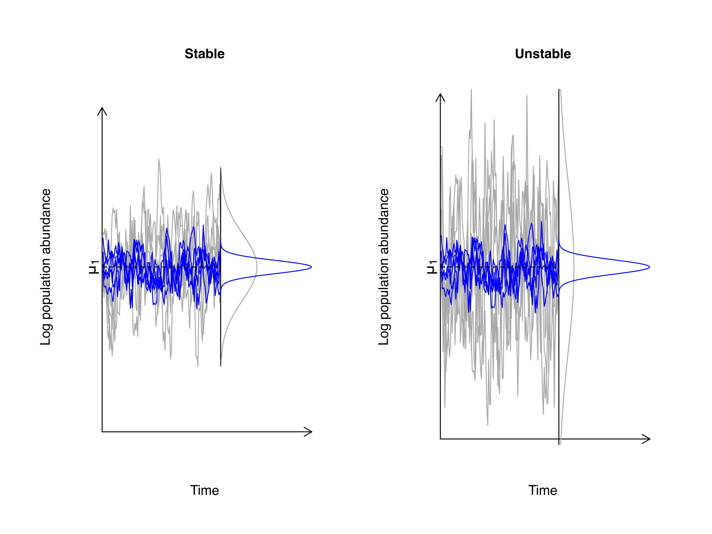
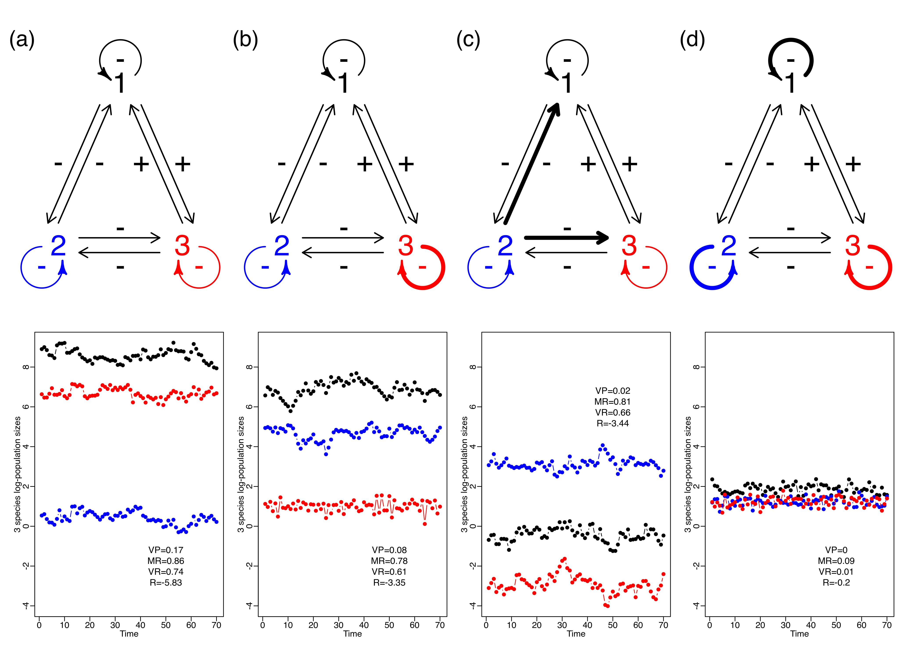

# Code to plot figures 1 and 2
The following code plots the figure 1 and figure 2 of the NIH data, using our simulations as described in the main manuscript.

[Ives A.R., Dennis B., Cottingham K.L. and S.R. Carpenter](https://doi.org/10.1890/0012-9615(2003)073%5B0301:ECSAEI%5D2.0.CO;2) showed that the overall effect of environmental fluctuations in the growth of a population is modulated by ecological processes. These authors showed that the growth rate of a population characterized by weak density-dependence was easily affected by fluctuations in the quality of the environment whereas those populations characterized by strong density-dependence were not. When presented with the same temporal regime of environmental variation a population with strong density-dependence will fluctuate much less than a population with weak density-dependence (see Figure below, which is Figure 1 in the main manuscript). Ives et al went on to show that for a single population, stability could be measured and conceptualized as the ratio of the magnitude of environmental variation to the strength of density dependence. This finding allows for a direct comparison of the reactions of two different populations to the same environmental noise regime. This insight that was brought about by Ives et al in the context of community ecology, made it possible to compare different populations and communities on the same level playing field.  This last point is made explicit in Figure 2 in the main manuscript, presented here after Figure 1. 


## Figure 1: Illustration of the definition of stochastic stability


```{r echo=TRUE, eval=FALSE}
########## Functions used saved in BPGSSToolkit.R ##########
source("ExampleCalcs/R/BPGSSToolkit.R")

# What is the half-life of the density dependent effect?


len1 <- 230;
tau1 <- 130;
a1 <- 3.5;
c1 <- 0.75;
sigmasq1 <- sigmasq2 <- 0.11#0.09725;
a2 <- 0.30;
c2 <- (1/2)^(1/10);
mu1 <- a1/(1-c1);
mu2 <- a2/(1-c2);
t.half <- log(1/2)/log(abs(c2))
mid.thalf <- tau1+t.half/2
mean.mean <- (mu1+mu2)/2

e.scaling <- 1/5

lowleft.m <- mu.vcov.calc(a1 = a1, c1 = c1, sigmasq1 = sigmasq1, a2 = a2, c2 = c2, sigmasq2=sigmasq2, tau=tau1,len=len1);
mean.t <- lowleft.m$mu.vec;
var.t <- lowleft.m$Sigma;
ts.reps <- my.rmvn(n=5, mu.vec=mean.t, cov.mat = var.t)
ts.reps.e <- my.rmvn(n=5, mu.vec=mean.t, cov.mat = var.t*e.scaling)
ts.reps.unstable <- my.rmvn(n=5, mu.vec=mean.t, cov.mat = var.t*3)


# Plot of 5 time series replicates stopping at the breakpoint
jpeg("Stable-Unstable-MARCH2025.jpeg",height=6,width=8,units="in",res=600,type="cairo")
#tiff("Stable-Unstable-MARCH2025.tiff",height=6,width=8,units="in",res=600,compression="lzw",type="cairo")

par(mfrow=c(1,2))

# Stable dynamics
par(bty="n", xaxt="n", yaxt="n", oma=c(1,1,1,1), mar=c(4,4,4,2),mgp=c(2,-2,-2))
matplot(1:tau1, ts.reps[1:tau1,], type="l", col=rep("darkgrey",5), lty=rep(1,5), ylim=c(mu1-2.5, mu1+2.5), xlim=c(-5,len1), xlab="Time", ylab="Log population abundance", cex.lab=0.9, main="Stable", cex.main=0.9)
arrows(x0=c(0,0),y0=c(mu1-2.5,mu1-2.5),x1=c(0,len1),y1=c(1.05*max(ts.reps),mu1-2.5),lwd=1, code=2,length=0.1)
matpoints(1:tau1, ts.reps.e[1:tau1,], type="l", col=rep("blue",5), lty=rep(1,5))

# Dotted line showing mean of first statio pdf
points(1:tau1, rep(mu1,tau1), type="l", lty=2, lwd=1)
text(x=-10,y=mu1, labels=expression(mu[1]),cex=1.05, srt=90)

# pdf of the statio distrib before the break point
sd1 <- sqrt(sigmasq1/(1-c1^2));
supp1 <- seq(mu1-3*sd1, mu1+3*sd1, by=0.01);
dens1 <- 50*dnorm(supp1,mean=mu1,sd=sd1);
supp2 <- seq(mu1-4*(sd1*e.scaling), mu1+4*(sd1*e.scaling), by=0.01);
dens2 <- 25*dnorm(supp2, mean=mu1, sd=e.scaling*sd1)
segments(x0=tau1,y0=mu1-3*sd1,x1=tau1,y1=mu1+3*sd1,col="black",lwd=1);
points(tau1+dens1,supp1,type="l",lty=1,lwd=1,col="darkgrey")
points(tau1+dens2,supp2,type="l",lty=1,lwd=1,col="blue")

# Unstable dynamics
#par(oma=c(1,1,1,2))
matplot(1:tau1, ts.reps.unstable[1:tau1,], type="l", col=rep("darkgrey",5), lty=rep(1,5), ylim=c(mu1-2.3, mu1+2.3), xlim=c(-5,len1), xlab="Time", ylab="Log population abundance", cex.lab=0.9,bty="n", xaxt="n", yaxt="n", main="Unstable", cex.main=0.9)
arrows(x0=c(0,0),y0=c(mu1-2.4,mu1-2.4),x1=c(0,len1),y1=c(1.05*max(ts.reps),mu1-2.4),lwd=1, code=2,length=0.1)
matpoints(1:tau1, ts.reps.e[1:tau1,], type="l", col=rep("blue",5), lty=rep(1,5))

# Dotted line showing mean of first statio pdf
points(1:tau1, rep(mu1,tau1), type="l", lty=2, lwd=1)
text(x=-10,y=mu1, labels=expression(mu[1]),cex=1.05, srt=90)

# pdf of the statio distrib before the break point
sdu <- sqrt(sigmasq1/(1-c1^2))*2.4;
suppu <- seq(mu1-2.4*sdu, mu1+2.4*sdu, by=0.01);
densu <- 50*dnorm(suppu,mean=mu1,sd=sdu);
segments(x0=tau1,y0=mu1-2.4*sdu,x1=tau1,y1=mu1+2.4*sdu,col="black",lwd=1);
points(tau1+densu,suppu,type="l",lty=1,lwd=1,col="darkgrey")
points(tau1+dens2,supp2,type="l",lty=1,lwd=1,col="blue")

dev.off()

```

The code above results in Figure 1 of the manuscript: 

## Figure 2:  The multivariate version of Figure 1

This figure is meant to illustrate how, in a multi-species setting, it is not only the strength of density dependence that defines the stochastic stability metrics but involves as well the magnitude and direction of the inter-specific interaction strengths.  Thus, it is expected that communities with different configurations regarding the intra-and inter-specfic interactions, as illustrated by the 3-species community graphs below, yield different metrics of the stochastic stability, as seen also below.  Note that even if all four communities were subjected to the very same environmental fluctuations simulated regime, they result in widely different log-population sizes and regimes of change/fluctuations. 


```{r echo=TRUE, eval=FALSE}
library(MASS)
library(shape)
#source('CLS.R')
source("ExampleCalcs/R/Poisson-MAR-ftns.R")
source("ExampleCalcs/R/error.barfunc.R")
load("ExampleCalcs/RData/FourStabilityScenarios.RData")

jpeg("FourStabilityScenarios-MARCH2025.jpeg",height=25,width=35,units="cm",res=300,type="cairo")

# tiff("FourStabilityScenarios-MARCH2025.tiff",height=25,width=35,units="cm",res=300,compression="lzw",
# type="cairo")

mat	<-	matrix(c(1:8),nrow=2,ncol=4,byrow=T)
layout(mat)
par(mar=c(0,0,0,0),oma=c(0.5,1,0.5,0.5))
plot(0,0,pch=".",col="white",xlab="",ylab="",xlim=c(0,1),ylim=c(0,1),axes=F)
###### Hypothetical examples 
##### Scenario 1: All interactions weak

text(0.5,0.775,"1",cex=4, col="black")
text(0.2,0.225,"2",cex=4, col="blue")
text(0.8,0.225,"3",cex=4, col="red")
arrows(0.2,0.3,0.45,0.7,lwd=2,length=0.15)
arrows(0.4,0.7,0.15,0.30,lwd=2,length=0.15)
arrows(0.3,0.25,0.69,0.25,lwd=2,length=0.15)
arrows(0.69,0.2,0.3,0.2,lwd=2,length=0.15)
arrows(0.8,0.3,0.55,0.7,lwd=2,length=0.15)
arrows(0.6,0.7,0.85,0.3,lwd=2,length=0.15)
plotcircle(mid=c(0.5,0.85),r=0.1,from=315*pi/180,to=225*pi/180,arrow=F, lcol="black")
Arrowhead(x0=0.43,y0=0.8,angle=317,arr.lwd=3,lcol="black")
plotcircle(mid=c(0.12,0.15),r=0.1,from=90*pi/180,to=360*pi/180,arrow=F,lcol="blue")
Arrowhead(x0=0.22,y0=0.15,angle=90,arr.lwd=3,lcol="blue")
plotcircle(mid=c(0.88,0.15),r=0.1,from=180*pi/180,to=90*pi/180,arrow=F,lcol="red")
Arrowhead(x0=0.78,y0=0.15,angle=90,arr.lwd=3,lcol="red")
coord.min	<-	c(0.5,0.85,0.12,0.15,0.88,0.15,0.4,0.5,0.2,0.5,0.5,0.28,0.5,0.15)
mat.min		<-	matrix(coord.min,nrow=7,ncol=2,byrow=T)
	for (i in 1:7){
		if(i==2){my.col<-"blue"}else if(i==3){my.col<-"red"}else{my.col<-"black"}
	  text(mat.min[i,1],mat.min[i,2],"-",cex=4, col=my.col)
	}
coord.plus	<-	c(0.6,0.5,0.8,0.5)	
mat.plus	<-	matrix(coord.plus,nrow=2,ncol=2,byrow=T)
	for (i in 1:2){
		text(mat.plus[i,1],mat.plus[i,2],"+",cex=4)
	}
#box()
mtext("(a)",adj=0,cex=2,line=-5)

###### Scenario 2: Only C has strong intraspecific competition
plot(0,0,pch=".",col="white",xlab="",ylab="",xlim=c(0,1),ylim=c(0,1),axes=F)
text(0.5,0.775,"1",cex=4, col="black")
text(0.2,0.225,"2",cex=4, col="blue")
text(0.8,0.225,"3",cex=4, col="red")
arrows(0.2,0.3,0.45,0.7,lwd=2,length=0.15)
arrows(0.4,0.7,0.15,0.30,lwd=2,length=0.15)
arrows(0.3,0.25,0.69,0.25,lwd=2,length=0.15)
arrows(0.69,0.2,0.3,0.2,lwd=2,length=0.15)
arrows(0.8,0.3,0.55,0.7,lwd=2,length=0.15)
arrows(0.6,0.7,0.85,0.3,lwd=2,length=0.15)
plotcircle(mid=c(0.5,0.85),r=0.1,from=315*pi/180,to=225*pi/180,arrow=F)
Arrowhead(x0=0.43,y0=0.8,angle=317,arr.lwd=3)
plotcircle(mid=c(0.12,0.15),r=0.1,from=90*pi/180,to=360*pi/180,arrow=F,lcol="blue")
Arrowhead(x0=0.22,y0=0.15,angle=90,arr.lwd=3,lcol="blue")
plotcircle(mid=c(0.88,0.15),r=0.1,from=180*pi/180,to=90*pi/180,arrow=F,lwd=6,lcol="red")
Arrowhead(x0=0.78,y0=0.15,angle=90,arr.lwd=3,lcol="red")
coord.min	<-	c(0.5,0.85,0.12,0.15,0.88,0.15,0.4,0.5,0.2,0.5,0.5,0.28,0.5,0.15)
mat.min		<-	matrix(coord.min,nrow=7,ncol=2,byrow=T)
	for (i in 1:7){
	  if(i==2){my.col<-"blue"}else if(i==3){my.col<-"red"}else{my.col<-"black"}
	  text(mat.min[i,1],mat.min[i,2],"-",cex=4, col=my.col)
	}
coord.plus	<-	c(0.6,0.5,0.8,0.5)	
mat.plus	<-	matrix(coord.plus,nrow=2,ncol=2,byrow=T)
	for (i in 1:2){
		text(mat.plus[i,1],mat.plus[i,2],"+",cex=4)
	}
#box()
mtext("(b)",adj=0,cex=2,line=-5)


####### Scenario 3: Weak intraspecific competittion but B has strong negative effect on A and C
plot(0,0,pch=".",col="white",xlab="",ylab="",xlim=c(0,1),ylim=c(0,1),axes=F)
text(0.5,0.775,"1",cex=4, col="black")
text(0.2,0.225,"2",cex=4, col="blue")
text(0.8,0.225,"3",cex=4, col="red")
arrows(0.2,0.3,0.45,0.7,lwd=6,length=0.15)
arrows(0.4,0.7,0.15,0.30,lwd=2,length=0.15)
arrows(0.3,0.25,0.69,0.25,lwd=6,length=0.15)
arrows(0.69,0.2,0.3,0.2,lwd=2,length=0.15)
arrows(0.8,0.3,0.55,0.7,lwd=2,length=0.15)
arrows(0.6,0.7,0.85,0.3,lwd=2,length=0.15)
plotcircle(mid=c(0.5,0.85),r=0.1,from=315*pi/180,to=225*pi/180,arrow=F)
Arrowhead(x0=0.43,y0=0.8,angle=317,arr.lwd=3)
plotcircle(mid=c(0.12,0.15),r=0.1,from=90*pi/180,to=360*pi/180,arrow=F,lcol="blue")
Arrowhead(x0=0.22,y0=0.15,angle=90,arr.lwd=3,lcol="blue")
plotcircle(mid=c(0.88,0.15),r=0.1,from=180*pi/180,to=90*pi/180,arrow=F,lcol="red")
Arrowhead(x0=0.78,y0=0.15,angle=90,arr.lwd=3,lcol="red")
coord.min	<-	c(0.5,0.85,0.12,0.15,0.88,0.15,0.4,0.5,0.2,0.5,0.5,0.28,0.5,0.15)
mat.min		<-	matrix(coord.min,nrow=7,ncol=2,byrow=T)
	for (i in 1:7){
	  if(i==2){my.col<-"blue"}else if(i==3){my.col<-"red"}else{my.col<-"black"}
	  text(mat.min[i,1],mat.min[i,2],"-",cex=4, col=my.col)
	}
coord.plus	<-	c(0.6,0.5,0.8,0.5)	
mat.plus	<-	matrix(coord.plus,nrow=2,ncol=2,byrow=T)
	for (i in 1:2){
		text(mat.plus[i,1],mat.plus[i,2],"+",cex=4)
	}
#box()
mtext("(c)",adj=0,cex=2,line=-5)

###### Scenario 4: Strong Intraspecific competition 
plot(0,0,pch=".",col="white",xlab="",ylab="",xlim=c(0,1),ylim=c(0,1),axes=F)
text(0.5,0.775,"1",cex=4, col="black")
text(0.2,0.225,"2",cex=4, col="blue")
text(0.8,0.225,"3",cex=4, col="red")
arrows(0.2,0.3,0.45,0.7,lwd=2,length=0.15)
arrows(0.4,0.7,0.15,0.30,lwd=2,length=0.15)
arrows(0.3,0.25,0.69,0.25,lwd=2,length=0.15)
arrows(0.69,0.2,0.3,0.2,lwd=2,length=0.15)
arrows(0.8,0.3,0.55,0.7,lwd=2,length=0.15)
arrows(0.6,0.7,0.85,0.3,lwd=2,length=0.15)
plotcircle(mid=c(0.5,0.85),r=0.1,from=315*pi/180,to=225*pi/180,arrow=F,lwd=6)
Arrowhead(x0=0.43,y0=0.8,angle=317,arr.lwd=3)
plotcircle(mid=c(0.12,0.15),r=0.1,from=90*pi/180,to=360*pi/180,arrow=F,lwd=6,lcol="blue")
Arrowhead(x0=0.22,y0=0.15,angle=90,arr.lwd=3,lcol="blue")
plotcircle(mid=c(0.88,0.15),r=0.1,from=180*pi/180,to=90*pi/180,arrow=F,lwd=6,lcol="red")
Arrowhead(x0=0.78,y0=0.15,angle=90,arr.lwd=3,lcol="red")
coord.min	<-	c(0.5,0.85,0.12,0.15,0.88,0.15,0.4,0.5,0.2,0.5,0.5,0.28,0.5,0.15)
mat.min		<-	matrix(coord.min,nrow=7,ncol=2,byrow=T)
for (i in 1:7){
  if(i==2){my.col<-"blue"}else if(i==3){my.col<-"red"}else{my.col<-"black"}    
  text(mat.min[i,1],mat.min[i,2],"-",cex=4, col=my.col)
}
coord.plus	<-	c(0.6,0.5,0.8,0.5)	
mat.plus	<-	matrix(coord.plus,nrow=2,ncol=2,byrow=T)
for (i in 1:2){
  text(mat.plus[i,1],mat.plus[i,2],"+",cex=4)
}
#box()
mtext("(d)",adj=0,cex=2,line=-5)

my.ylim <- c(log(min(ts.mat4)),log(max(ts.mat)))

text.cex <- 1.25

par(mar=c(3,3,1,1),mgp=c(1.5,0.5,0))
plot(1:70,log(ts.mat[1,]),xlab="Time",ylab="3 species log-population sizes",
     cex.axis=1.2, cex.lab=1.2,pch=19,type="b",ylim=my.ylim)
points(1:70,log(ts.mat[2,]),pch=19,col="blue",type="b")
points(1:70,log(ts.mat[3,]),pch=19,col="red",type="b")
text(x=50,y=-2, paste0("VP=",round(ex1.stab[[1]],2),"\n","MR=",round(ex1.stab[[2]][1],2),
             "\n","VR=",round(ex1.stab[[2]][2],2),"\n","R=", 
             round(ex1.stab[[3]],2)),cex=text.cex)
# mtext(paste0("VP=",round(ex1.stab[[1]],2),"\n","MR=",round(ex1.stab[[2]][1],2),
#              "\n","VR=",round(ex1.stab[[2]][2],2),"\n","R=", 
#              round(ex1.stab[[3]],2)),at=55,line=-12,adj=0)


plot(1:70,log(ts.mat3[1,]),xlab="Time",ylab="3 species log-population sizes",
     cex.axis=1.2, cex.lab=1.2,pch=19,type="b",ylim=my.ylim)
points(1:70,log(ts.mat3[2,]),pch=19,col="blue",type="b")
points(1:70,log(ts.mat3[3,]),pch=19,col="red",type="b")
text(x=50,y=-2, paste0("VP=",round(ex3.stab[[1]],2),"\n","MR=",round(ex3.stab[[2]][1],2),
              "\n","VR=",round(ex3.stab[[2]][2],2),"\n","R=",
              round(ex3.stab[[3]],2)),cex=text.cex)

# mtext(paste0("VP=",round(ex3.stab[[1]],2),"\n","MR=",round(ex3.stab[[2]][1],2),
#              "\n","VR=",round(ex3.stab[[2]][2],2),"\n","R=",
#              round(ex3.stab[[3]],2)),at=55,line=-14,adj=0)


plot(1:70,log(ts.mat4[1,]),xlab="Time",ylab="3 species log-population sizes",
     cex.axis=1.2,cex.lab=1.2,pch=19,type="b",ylim=my.ylim)
points(1:70,log(ts.mat4[2,]),pch=19,col="blue",type="b")
points(1:70,log(ts.mat4[3,]),pch=19,col="red",type="b")
text(x=50,y=6,paste0("VP=",round(ex4.stab[[1]],2),"\n","MR=",round(ex4.stab[[2]][1],2),
             "\n","VR=",round(ex4.stab[[2]][2],2),"\n","R=",
             round(ex4.stab[[3]],2)),cex=text.cex)

# mtext(paste0("VP=",round(ex4.stab[[1]],2),"\n","MR=",round(ex4.stab[[2]][1],2),
#              "\n","VR=",round(ex4.stab[[2]][2],2),"\n","R=",
#              round(ex4.stab[[3]],2)),at=55,line=-10,adj=0)


plot(1:70,log(ts.mat2[1,]),xlab="Time",ylab="3 species log-population sizes",
     cex.axis=1.2,cex.lab=1.2,pch=19,type="b",ylim=my.ylim)
points(1:70,log(ts.mat2[2,]),pch=19,col="blue",type="b")
points(1:70,log(ts.mat2[3,]),pch=19,col="red",type="b")
text(x=50, y=-2, paste0("VP=",round(ex2.stab[[1]],2),"\n","MR=",round(ex2.stab[[2]][1],2),
             "\n","VR=", round(ex2.stab[[2]][2],2),"\n","R=",
             round(ex2.stab[[3]],2)),cex=text.cex)

dev.off()

```

This code results in Figure 2 of the manuscript: 


