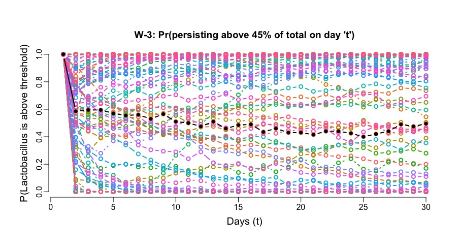
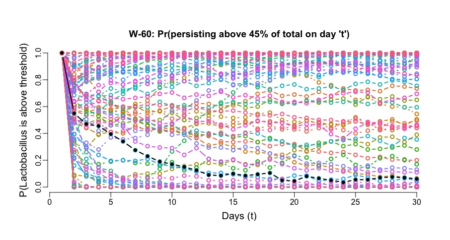
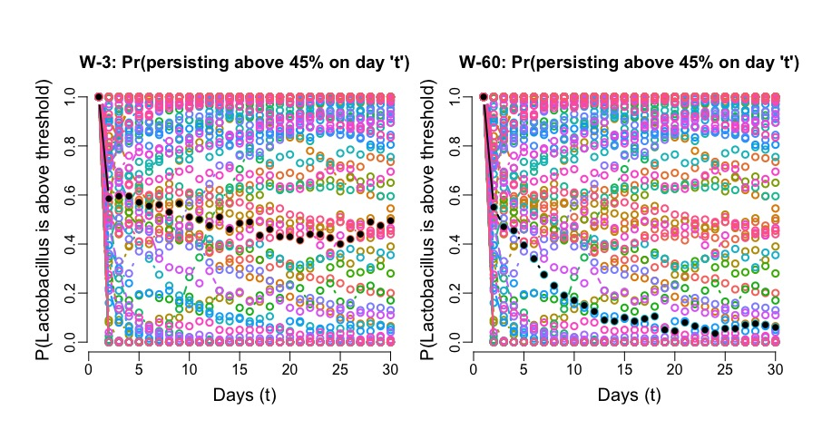
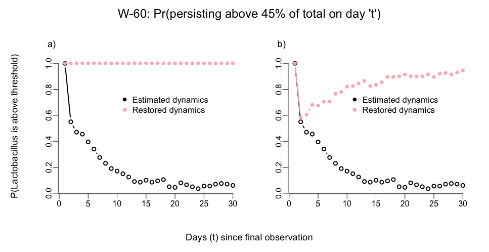

# Figure 7: Calculation of time-dependent persistence probabilities, 2-species model

The very first thing we need to do is to import the ML estimates of the MAR model
parameter estimates for every woman in our data set, along with the estimated noise-filtered trajectories:
```{r echo=TRUE, eval=FALSE}
load("ExampleCalcs/RData/Stability4TwoSppData2.0.RData")
```


Then we need the following two functions:  1) a Multivariate Normal Random Number 
generator of our own, for simplicity and 2) a two species MAR model simulator.  Here they are:

```{r eval=TRUE, echo=TRUE}
# 1. rand.MVN:  Multivariate Normal random number generator
#    n = number of random samples of a MVN vector
#    mu = mean vector of the MVN distribution to sample from
#    cov.mat = Variance-covariance matrix of the MVN distribution to sample from
randmvn <- function(n,mu.vec, cov.mat){
  
  p <- length(mu.vec);
  Tau <- chol(cov.mat);
  Zmat <- matrix(rnorm(n=p*n,mean=0,sd=1),nrow=p,ncol=n); #generate normal deviates outside loop
  out <- matrix(0,nrow=p,ncol=n);
  for(i in 1:n){
    
    Z <- Zmat[,i];
    out[,i] <- t(Tau)%*%Z + mu.vec
    
  }
  
  return(out)
  
}

# Returns the population abundance (NOT log)
# for a 2 spp MAR model
Twospp.mar <- function(A,B,Sigma,len,Xo,rnd.init=FALSE){
  
  # if rnd.int==FALSE, provide ann initial Xo value
  Xmat <- matrix(0,ncol=len,nrow=2)
  X.start <- Xo
  if(rnd.init==TRUE){
    Vec.V <- ginv(diag(4) - kronecker(B,B))%*%as.vector(Sigma) # Eq. 17th Ives et al 2003
    V <- matrix(Vec.V, nrow=2,ncol=2,byrow=FALSE)
    #if(V[2,2]<0){V[2,2] <-Sigma[2,2]/(1-B[2,2]^2)}
    muvec <- ginv(diag(2)-B)%*%A
    zero.mean.tst <- muvec<=log(.Machine$double.xmin)
    if(sum(zero.mean.tst)>0){muvec[zero.mean.tst==1]<- log(.Machine$double.xmin)}
    X.start <- randmvn(n=1,mu.vec= muvec , cov.mat=V)
    
  }
  Xmat[,1] <- X.start
  
  for( i in 2:len){
    
    im1 <- i-1;
    Xim1  <- matrix(Xmat[,im1], nrow=2,ncol=1)
    mui <- A + B%*%Xim1
    rand.trans <- randmvn(n=1,mu.vec= mui, cov.mat=Sigma)
    Xmat[,i] <- rand.trans
  }
  
  return(t(exp(Xmat)))	
}


```

The idea of applying the Population Viability Monitoring of [Staples *et al.*, 2005](https://conbio.onlinelibrary.wiley.com/doi/full/10.1111/j.1523-1739.2005.00283.x) to microbiome community data is to track the percent of times the forward simulation of population drops below a threshold of interest one, two, three, etc... time steps in the future.  The same calculation is repeated adding 1 to the number of simulated time steps, one at a time.  To do that, we need to define the number of time steps and the threshold times at which we are going to repeat these calculations.  Finally, we will repeat the same calculations for ALL the women subjects in our data set.  Here are the basic quantities and empty matrices where we will store the results: 

```{r echo=TRUE, eval=FALSE}
thres <- 0.45#0.25
thres.times <- 2:30#c(3,5,10,20,50,75,100)
len.sim <- max(thres.times)
nthreshs <- length(thres.times)
labs.thresh <- paste0("PT",thres.times)
PFall.mat <- matrix(0,nrow=nshort,ncol=nthreshs)
colnames(PFall.mat) <- labs.thresh
row.names(PFall.mat) <- short.labs
nchains <- 200
NtimesNo <- 1

```
Next, in this long for loop, we use the powerful combination of `parse()` and `eval()` to compute the persistence probabilities above a 45% threshold, for 2 to 30 time steps ahead:


```{r threscalcs, echo=TRUE, eval=FALSE}
for(i in 1:nshort){
  ith.ind <- i#10#25#
  ith.commat <- Two.spp.commats[[ith.ind]]
  ith.len <- nrow(ith.commat)
  ith.A <- mles.list[[ith.ind]]$A
  ith.B <- mles.list[[ith.ind]]$B
  ith.S <- mles.list[[ith.ind]]$sigma
  ith.muvec <- ginv(diag(2)-ith.B)%*%ith.A
  ith.half <- 0.5*sum(ith.muvec)
  #print(exp(ith.muvec))
  ith.xo <- rep(ith.half,2) #ith.muvec #log(NtimesNo) +  ith.commat[ith.len,]
  #ith.initot <- sum(exp(ith.muvec))
  #Nthres <- thres*ith.initot
  for(k in 1:nthreshs){
    code.line1 <- paste0("cross.thres",k," <-rep(0,nchains)")
    eval(parse(text=code.line1))
  }
  
  for(j in 1:nchains){
    sim.mat <- Twospp.mar(A=ith.A, B=ith.B, Sigma=ith.S,len=len.sim,Xo=ith.xo,rnd.init=FALSE)
    #print(sim.mat)
    for(h in 1:nthreshs){
      #			test <- sum((sim.mat[1:thres.times[h],1]/apply(sim.mat[1:thres.times[h],],1,sum))<thres)>0			
      test <- sum((sim.mat[thres.times[h],1]/sum(sim.mat[thres.times[h],]))<thres)>0
      code.line2 <- paste0("cross.thres",h,"[j] <- test")
      eval(parse(text=code.line2))
    }
  }
  for(ell in 1:nthreshs){
    code.line3 <- paste0("PFall.mat[i,",ell,"] <- sum(cross.thres",ell,")/nchains")
    eval(parse(text=code.line3))
  }  
  
}	

Tthres.mat <- matrix(rep(c(1,thres.times),nshort), nrow=nthreshs+1, ncol=nshort,byrow=FALSE)
tPFall.mat <- t(cbind(rep(0,nshort),PFall.mat))

```

Now let's pick one particular subject, say woman 3, and plot the changes in persistence probabilities over time of this subject in black and in the background, in other colors, the persistence probabilities of all the rest of the women's communities in the data set
```{r Figure7left, echo=TRUE, eval=FALSE}
i<-3
stab.level <- belongingsF[i]
par(mar=c(3,3,3,1),  oma=c(2,2,2,1), mgp=c(2,0.5,0))
matplot(x=Tthres.mat,y=1-tPFall.mat, type="b", pch=1, col=mycols.ftn(nshort), 
      lwd=2,xlab="Days (t)", ylab=paste0("P(Lactobacillus is above threshold)"), 
      cex.lab=1.25, main=paste0(short.labs[i],": Pr(persisting above ",
      thres*100,"% of total on day 't')"),bty="n")

points(Tthres.mat[,i], 1-tPFall.mat[,i], type="b", pch=16, col="black", lwd=2)

```
And we get

And now the data for woman 60, to compare

```{r Figure7right, echo=TRUE, eval=FALSE}

i<-46
stab.level <- belongingsF[i] # Woman 60 is the 46th data set
par(mar=c(3,3,3,1),  oma=c(2,2,2,1), mgp=c(2,0.5,0))
matplot(x=Tthres.mat,y=1-tPFall.mat, type="b", pch=1, col=mycols.ftn(nshort), 
      lwd=2,xlab="Days (t)", ylab=paste0("P(Lactobacillus is above threshold)"), 
      cex.lab=1.25, main=paste0(short.labs[i],": Pr(persisting above ",
      thres*100,"% of total on day 't')"),bty="n")
points(Tthres.mat[,i], 1-tPFall.mat[,i], type="b", pch=16, col="black", lwd=2)

```

And we get



Now let's plot both together for the main manuscript:


```{r Figure7all, echo=TRUE, eval=FALSE}

plotfname <- paste0("Figure7-March2025.tiff")	
tiff(plotfname, width=8.5,height=6, units="in", res=600, compression="lzw",type="cairo", family="times")
par(mfrow=c(1,2), mar=c(3,3,3,2),  oma=c(2,2,2,1), mgp=c(2,0.5,0))

i<-3
stab.level <- belongingsF[i] 
matplot(x=Tthres.mat,y=1-tPFall.mat, type="b", pch=1, col=mycols.ftn(nshort), 
      lwd=1,xlab="Days (t)", ylab=paste0("P(Lactobacillus is above threshold)"), 
      cex.lab=1.15, main=paste0(short.labs[i],": Pr(persisting above ",
      thres*100,"% on day 't')"),bty="n")
points(Tthres.mat[,i], 1-tPFall.mat[,i], type="b", pch=16, col="black", lwd=2)

i<- 46
stab.level <- belongingsF[i] 
matplot(x=Tthres.mat,y=1-tPFall.mat, type="b", pch=1, col=mycols.ftn(nshort), 
      lwd=1,xlab="Days (t)", ylab=paste0("P(Lactobacillus is above threshold)"), 
      cex.lab=1.15, main=paste0(short.labs[i],": Pr(persisting above ",
      thres*100,"% on day 't')"),bty="n")
points(Tthres.mat[,i], 1-tPFall.mat[,i], type="b", pch=16, col="black", lwd=2)
dev.off()


```
And we get the figure, which is Figure 7 in the main manuscript:



# Figure 8: Demonstration of restoration ecology through persistence probabilities

As we have amply mentioned in the manuscript, changes in intra and inter specific interactions change the population dynamics trajectory (mean trend and variance) and hence change the probabilities that the population fluctuations will remain above certain threshold.  So what we do next, as we explain in the main manuscript is that we change two things:  First, we flip the sign of the inter-specific interactions for our two-species model and for the community time series data of `woman60`. For this data set, the effect of the non-Lactobacillus on the Lactobacilli was estimated to be negative whereas the efffect of the Lactobacillus on the non-Lactobacilli was estimated to be positive.  Those effects meant that ultimately, the growth rate of the Lactobacilli was negatively affected by the growth of the other bacteria with the consequence that the persistence probabilities of the Lactobacilli tended to decay over time, as seen in the previous figure.  So we flipped the signs of these two estimates and re-didthe simulations and calculations of the persistence probabilities, which resulted in a restoration of the chances of persistence for the lactobacilli.  As an added bonus, we also tried to simply increse the growth rate instead of flipping the sign of the inter-specific effects.  Here is the code to do those calculations and the resulting graph, which is Figure 8 in the main manuscript:

```{r Fig8left, echo=TRUE, eval=FALSE}

New.PFallvec <- rep(0,nthreshs)
# Set i= 46 to work with woman 60
ith.ind <- 46#10#25#
ith.commat <- Two.spp.commats[[ith.ind]]
ith.len <- nrow(ith.commat)
ith.A <- mles.list[[ith.ind]]$A
print(ith.A)
ith.B <- mles.list[[ith.ind]]$B
print(ith.B)
# Now increase the strength of DDP for Lactobacillus
#ith.B[1,1] <- 0.95
ith.B[1,2] <- -ith.B[1,2]
ith.B[2,1] <- -ith.B[2,1] 
ith.S <- mles.list[[ith.ind]]$sigma
ith.muvec <- ginv(diag(2)-ith.B)%*%ith.A
ith.half <- 0.5*sum(ith.muvec)
ith.xo <- rep(ith.half,2)
for(k in 1:nthreshs){
	code.line1 <- paste0("cross.thres",k," <-rep(0,nchains)")
	eval(parse(text=code.line1))
}
for(j in 1:nchains){
	sim.mat <- Twospp.mar(A=ith.A, B=ith.B, Sigma=ith.S,len=len.sim,Xo=ith.xo,rnd.init=FALSE)
	#print(sim.mat)
	for(h in 1:nthreshs){
		test <- sum((sim.mat[thres.times[h],1]/sum(sim.mat[thres.times[h],]))<thres)>0
		code.line2 <- paste0("cross.thres",h,"[j] <- test")
		eval(parse(text=code.line2))
	}
}
for(ell in 1:nthreshs){
	code.line3 <- paste0("New.PFallvec[",ell,"] <- sum(cross.thres",ell,")/nchains")
	eval(parse(text=code.line3))
}  

New.PPersist <- c(1,1-New.PFallvec)

rbind(New.PPersist,c(1,1-PFall.mat[46,]))


stab.level <- belongingsF[46]
plotfname <- paste0("Figure8-March2025.tiff")	

tiff(plotfname,  width=8.5,height=6, units="in", res=600, compression="lzw",type="cairo", family="times")
par(mfrow=c(1,2), mar=c(4,4,4,1),  oma=c(2,2,2,1), mgp=c(2,0.5,0))

plot(x=Tthres.mat[,1],y=c(1,1-PFall.mat[46,]), type="b", pch=1, col="black", lwd=2, ylab="", 
main="",bty="n", xlab="")
points(Tthres.mat[,1], New.PPersist, type="b", pch=16, col="lightpink", lwd=2)
legend(x=10,y=0.8, legend=c("Estimated dynamics","Restored dynamics"), pch=c(16,16), col=c("black","lightpink"), cex=1.05, bty="n")
mtext("a)", side=3, at=-2,line=1,adj=0, cex=1.15)
#text(x=1.5,y=1.1,labels="(a)", cex=1.15)
#dev.off()

#####  Now increasing the growth rate of lactobacillus

New.PFallvec <- rep(0,nthreshs)
# Set i= 46 to work with woman 60
ith.ind <- 46#10#25#
ith.commat <- Two.spp.commats[[ith.ind]]
ith.len <- nrow(ith.commat)
ith.A <- mles.list[[ith.ind]]$A
print(ith.A)
ith.B <- mles.list[[ith.ind]]$B
print(ith.B)
ith.A[1] <- ith.A[1]*1.25

ith.S <- mles.list[[ith.ind]]$sigma
ith.muvec <- ginv(diag(2)-ith.B)%*%ith.A
ith.half <- 0.5*sum(ith.muvec)
ith.xo <- rep(ith.half,2)
for(k in 1:nthreshs){
	code.line1 <- paste0("cross.thres",k," <-rep(0,nchains)")
	eval(parse(text=code.line1))
}
for(j in 1:nchains){
	sim.mat <- Twospp.mar(A=ith.A, B=ith.B, Sigma=ith.S,len=len.sim,Xo=ith.xo,rnd.init=FALSE)
	#print(sim.mat)
	for(h in 1:nthreshs){
		test <- sum((sim.mat[thres.times[h],1]/sum(sim.mat[thres.times[h],]))<thres)>0
		code.line2 <- paste0("cross.thres",h,"[j] <- test")
		eval(parse(text=code.line2))
	}
}
for(ell in 1:nthreshs){
	code.line3 <- paste0("New.PFallvec[",ell,"] <- sum(cross.thres",ell,")/nchains")
	eval(parse(text=code.line3))
}  

New.PPersist <- c(1,1-New.PFallvec)

rbind(New.PPersist,c(1,1-PFall.mat[46,]))


stab.level <- belongingsF[46]
plot(x=Tthres.mat[,1],y=c(1,1-PFall.mat[46,]), type="b", pch=1, col="black", lwd=2, ylab="", 
main="",bty="n", xlab="")
points(Tthres.mat[,1], New.PPersist, type="b", pch=16, col="lightpink", lwd=2)
legend(x=10,y=0.8, legend=c("Estimated dynamics","Restored dynamics"), pch=c(16,16), col=c("black","lightpink"), cex=1.05, bty="n")
mtext("b)", side=3, at=-2,line=1,adj=0, cex=1.15)
#text(x=1.5,y=1.1,labels="(b)",cex=1.15)

mtext(text=paste0(short.labs[46],": Pr(persisting above ",thres*100,"% of total on day 't')"), side=3, outer=TRUE, adj=0.5, cex=1.5)

mtext(text="P(Lactobacillus is above threshold)", side=2,outer=TRUE, adj=0.5, cex=1.15)

mtext(text="Days (t) since final observation", side=1,outer=TRUE, adj=0.5, cex=1.15)
dev.off()


```



