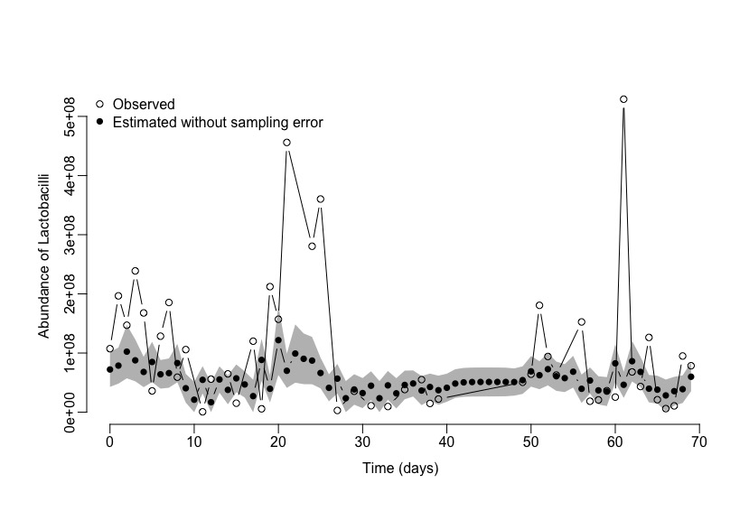
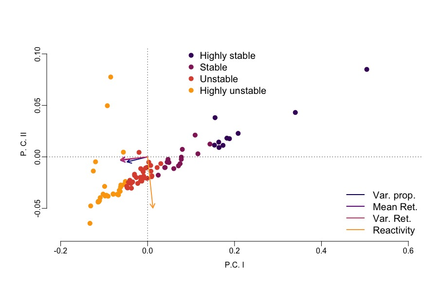

\clearpage

```{r echo=FALSE, eval=TRUE}

thisdir <- getwd()
```

# Read me (begin here)

This file is the code used for our manuscript with same title above *submitted* to ***npj***. This is a practical tutorial aimed at giving a simple and intuitive introduction to fitting stochastic population dynamics models to microbial community ecology scientists. Our aim with this document is to present as simply as possible a quantitative approach to fit a continuous time stochastic population dynamics model to bacterial community time series data, with the goal of estimating stochastic stability metrics for the bacterial community, as described in the main text of our manuscript. The code presented here was newly developed for this project.

-   The statistical theory used for parameter estimation was first developed in our 2014 paper funded by our microbiome project [Dennis & Ponciano, (2014)](https://esajournals.onlinelibrary.wiley.com/doi/abs/10.1890/13-1486.1). This paper presents the fitting of a Stochastic Differential Equation with a Gompertz model, which upon log transformation (Ito transformation) becomes an OU process. In particular, we show how this Ito transformation conveniently simplifies the problem of having having missing time points in the time series data.

-   The computational methods to estimate the stochastic stability properties were originally developed in [Ives A.R., Dennis B., Cottingham K.L. and S.R. Carpenter](https://doi.org/10.1890/0012-9615(2003)073%5B0301:ECSAEI%5D2.0.CO;2), and reprogrammed in R by J.P. Gomez and J.M. Ponciano.

-   Simultaneously to this manuscript, J.M. Ponciano used the stochastic stability calculations of Ives et al in this exclusively computational/simulated data paper recently accepted for publication: [Gaynor M.L., Kortessis N., Soltis D.E., Soltis P.S. and J.M. Ponciano](https://www.journals.uchicago.edu/doi/10.1086/734411).

-   The application of Population Viability Monitoring ideas of [Staples *et al.*, 2005](https://conbio.onlinelibrary.wiley.com/doi/full/10.1111/j.1523-1739.2005.00283.x) to microbiome community data is new and programmed de-novo for this current manuscript.

Finally, all code presented and used here was written by J.M. Ponciano and J.P. Gomez.

# Packages and functions

## Required packages

```{r package-loading, message=FALSE, warning=FALSE}
# From Venables and Ripley, the good old MASS to compute generalized inverses
library(MASS)

```

## Required function libraries

Here we import the functions in [Dennis & Ponciano, (2014)](https://esajournals.onlinelibrary.wiley.com/doi/abs/10.1890/13-1486.1) that we originally presented in the function library **ROUSSE2.0**.

```{r loading-function-libraries, eval=FALSE}
# Import the OU population dynamics functions from
# Dennis and Ponciano 2014
source("ExampleCalcs/R/ROUSS/ROUSSE-2.0.R")

```

The functions uploaded in the `ROUSSE-2.0` library include

-   `ROUSS.CALCS()`: A wrapper for all the functions in the library listed below. This is function can be called with a single line and computes all the OU process calculations as well. It is meant to free the user from the hassle of having to learn how every single one of the functions below, also called by this library, works. These other functions are:
-   `correct.time()`: used to make sure the entered vector of time steps does not have mistakes
-   `negloglike.OU.ml()`: The negative log-likelihood function to fit the population dynamics OU model
-   `negloglike.OU.reml()`: The negative log-likelihood function used to fit the OU model via Restricted Maximum Likelihood
-   `randmvn()`: our own Multivariate Normal random number generator (coded here to minimize dependencies with other libraries)
-   `ROUSS.sim()`: function to simulate data according to the OU model. This function is used to compute numerically the time-dependent estimates of persistence probability for a species of interest as explained in the manuscript.
-   `guess.calc()`: a function to compute a good starting point of the OU model parameters for the optimization process.
-   `ROUSS.ML()`: a wrapper function using the functions `correct.time()`, `negloglike.OU.ml()`, `randmvn()` and `guess.calc()` to return the ML estimates of the OU model parameters, for one species.
-   `ROUSS.REML()`: a wrapper function using the functions `correct.time()`, `negloglike.OU.reml()`, `randmvn()` and `guess.calc()` to return the REML estimates of the OU model parameters, for one species. Dennis, Ponciano et al (2006) demonstrated that the REML estimates often have better statistical properties (less bias) than the ML estimates when the time series data are short in length.
-   `ROUSS.predict()`: a function to calculate the estimated abundances after accounting for sampling error. These are the black circles wrapped by a gray confidence band as seen in Figure 4 in the main manuscript. The outcome of this function is THE single most important outcome to do the stability calculations as we show below. Note that this function outputs as well the maximum likelihood estimated abundances of the population process for time steps with missing observations. To be able to compute the confidence bands as seen in Figure 4, one needs the parametric bootstrap function below:
-   `ROUSS.pboot()`: Do a parametric bootstrap (using either REML or ML) to estimate confidence intervals of model parameters as well as the confidence intervals of the predictions of the population abundances filtered from sampling error as seen in Figure 4 in the main manuscript.

## Other useful functions

Here we load other useful functions that we created for this manuscript.

```{r loading-functions, eval=FALSE}

# Automatically choosing 'k' colours for plots from a colour-blind friendly palette
mycols.ftn <- function(n){
	d <- 360/n
	h <- cumsum(c(15,rep(d,(n-1))))
	return(hcl(h=h, c=100,l=65))
}

# My own PCA function with transparent calculations
source("ExampleCalcs/R/mypca.R")

```

Because the purpose of this help file is to show how to fit and work with a stochastic population dynamics model for bacteria community data, here we do not recapitulate the entire data cleaning process, which can be found at the start of the file `HMP_metadata_updated_taxonomy_StR_CSTs_020619.R`. The outcome of the code in that file are the raw time series of readcounts anchored in estimates of total abundances, for every bacterial species of interest, and for every bacterial community/subject, as explained in the methods and in the supplemental files. In order to not having to iterate the same code over and over for every community data set, we created the function `nas.cleaning.R` which can be simply uploaded by sourcing it:

```{r data-cleaning function, eval=FALSE}
source("ExampleCalcs/R/nas.cleaning.R")
```

Finally, before actually starting illustrating how the population dynamics model works, we just remind the user that the most relevant step of the data preparation process, besides removing `NA`'s using the function above is to determine if your time series for the $p$ species you are interested in is long enough. As explained in the section "Minimal sample size to fit a MAR model" in the main manuscript, if $n$ is the length of the time series in your data set and for each species you have $m \geq 1$ replicated counts, then a straightforward check is to verify that the inequality $$ (n-1)mp > 2p^{2} + p$$ holds true. If so, then the model parameters are indeed estimable. In the file `HMP_metadata_updated_taxonomy_StR_CSTs_020619.R` we implemented this check automatically for all the available data (lines 160-195).

# Illustration of the MAR model parameter estimation process

## Filtering sampling error from the time series data of abundances

Ideally, the MAR model parameter estimation process and the sampling error filtering process are merged into a single estimation step. As mentioned in the manuscript, there is currently still statistical debate regarding the merits of integrating all estimation into a one-step process. Much discussion regarding estimability of model parameters and the quality of the estimates still abounds. Examining the statistical properties of these estimators for community time series data is subject for another in-depth, statistical manuscript. Here, as explained in the main manuscript, we do first a sampling error filtering step followed by a MAR model and stochastic stability estimation step. As long as one leaves the user the option to propagate the uncertainty from one estimation step into the next step (as our program does), this approach remains suitable. There is always room for improving coding and statistical approaches but our main objective here is to illustrate code usage and concepts.

Anyways, enough said. First, let's upload the cleaned raw data for all of our subjects (the outcome of running the file `HMP_metadata_updated_taxonomy_StR_CSTs_020619.R`)

```{r loading-rawdata, eval=FALSE}
load("ExampleCalcs/RData/allhmpdata3.0.RData")
load("ExampleCalcs/RData/integrateddata2.RData")

# Extracting the bacterial community abundances for the 25th listed community
samp.tss <- integrated.data2[[25]] # W-30

# Retrieving the vector of times, re-scaling it to start at 0
# and creating a longer vector of times that does not skip any time step.
# This last step is done because the original time vector might have missing 
# sampled days.
Time.t <- as.numeric(samp.tss$raw.days)
tt <- Time.t-Time.t[1]
long.t <- tt[1]:max(tt)

# Store the lengths of the short and long times vec. to use below
ithlens     <- length(Time.t) # here ithlens = 48
ithlong.lens <- length(long.t) # here ithlong.lens = 70
```

Note that since $70 - 48 = 22$ it means that there are $22$ days for which observations were missing for this particular bacterial community. The OU calculations below predict the noise-filtered abundances for those missed days as well. The statistical calculations done to get these estimates were NOT published in [Dennis & Ponciano, (2014)](https://esajournals.onlinelibrary.wiley.com/doi/abs/10.1890/13-1486.1) and hence constitute a new statistical tool, presented for the first time in this manuscript. Below we do the noise filtering for a single time series as an example, but in the main manuscript code we loop this calculation over all bacteria species in each community (woman subject) and over all subject data. This looping is done in the file `AllKalmanPreds.R`. Finally, instead of picking a single bacteria species here, we pool together all the *Lactobacilli* abundances; recall that in the main manuscript we find that a community model with just 2 species/types describes best the observed dynamics. Those two types were the Lactobacilli and the rest of the species chosen (see main methods for details).

```{r noise-filtered-abunds-II, eval=FALSE}
# Now  retrieving the total abundances of all Lactobacilli
# and putting them in log-scale for analysis:
all.lacto <- apply(samp.tss[,9:12],1,sum)
log.obs <- log(all.lacto)

# Setting the options for the `ROUSS.CALCS()` function:
# Do you want to compute the ML estimates or the REML estimates?
method <- "REML" # alternatively, set method <- "ML"
# Do you want to plot the predictions?
pred.plot <- "FALSE" # We do not want to immediately plot the predictions
# Do you want to plot the parametric bootstrap distribution of the estimates?
pboot.plot <- "FALSE" # Set it to "FALSE"  because we don't want the CI of the
                      # OU model parameters
NBoot <- 1000 # Number of bootstrap replicates for the CI of the noise filtered 
              # abundances (the predictions)

# And with just this one command, we can do all the Ponciano & Dennis OU 
# calculations, including the prediction.  We use 1000 bootstrap replicates

ts.results <- ROUSS.CALCS(Yobs=log.obs,Tvec=Time.t, pmethod=method, nboot=NBoot, 
                          plot.pred=pred.plot, plot.bootdists = pboot.plot);  


# Reading out the results:  the predictions with CI's for the time steps with
# observations AND for the time steps with missing observations
ts.pboot.cis <- ts.results$pboot.cis
longpred.mle <- ts.results$pboot.preds2[,3]
longpred.lci <- ts.results$pboot.preds2[,2]
longpred.uci <- ts.results$pboot.preds2[,4]

shortpred.mle <- ts.results$pboot.preds1[,3]
shortpred.lci <- ts.results$pboot.preds1[,2]
shortpred.uci <- ts.results$pboot.preds1[,4]
```

The results lead to the plot shown in Figure 4 in the main manuscript. The commands to do that plot are:

```{r noise-filtered-plot, eval=FALSE}
par(mar=c(3,3,3,1),  oma=c(2,2,2,1), mgp=c(2,0.5,0))
plot(tt,all.lacto, pch=1,type="n", bty="n", xlab="Time (days)", 
     ylab="Abundance of Lactobacilli")
polygon(x=c(long.t,rev(long.t)), y=c(longpred.lci,rev(longpred.uci)), 
        col="grey", border=NA)
points(tt,all.lacto, pch=1, type="b")
points(long.t,longpred.mle, pch=16, type="b")
legend("topleft", legend=c("Observed", "Estimated without sampling error"), 
       pch=c(1,16),bty="n")

```

which results in the plot <!----> 

As mentioned above, in the file `AllKalmanPreds.R` we do the noise-filtering for all the target bacterial species time series, and for all subjects for which we have data. For each subject, we saved in a as a `txt` file the noise filtered abundances for every target species. These are the files named `longkalman-woman1.txt`, `longkalman-woman10.txt`, etc... These are the data sets that we used for the MAR model stability calculations shown in the manuscript.

## The MAR model stability calculations, one example

In the main manuscript we show that the model that resulted in the most robust stability classification was the two species/types model, where we grouped the Lactobacilli as one "species" and the rest of the species as the second "species". We then estimated the 2-species MAR model parameters using CLS, which stands for "Conditional Least Squares". This estimation was conducted by pro- gramming in `R` the equations in the subsection "Conditional Least Squares", page 313 (including equations 30 and 31) of [Ives et al 2003](https://doi.org/10.1890/0012-9615(2003)073%5B0301:ECSAEI%5D2.0.CO;2). These calculations were packaged into a single function which we named `mars.cls()` whose only argument is the matrix of noise-filtered abundances. The function is stored Here's an example with the first data set

```{r mars-caclcsI, echo=TRUE}
# Load the initial data: we are only going to borrow the ID labels from it
load("./RData/integrateddata2.RData")

# load the mars.cls function
source("./R/mars.cls.R")
source("./R/stability.R")

fname <- paste0("./Data/longkalman-",names(integrated.data2)[1] ,".txt")
kalman.mat <- read.table(file=fname, header=TRUE)
dim(kalman.mat) # this is a matrix of abundances for 69 time steps x 14 species
                # plus one column (the first one) indicating the sampling day

comm.mat1 <- kalman.mat[,-1] # remove the first column with the days

# Finding the columns with Lactobacillus species and adding them up
Lactocols <- which(grepl("Lactobacillus", colnames(comm.mat1))==TRUE,arr.ind=TRUE)

if(length(Lactocols)==1){Lacto.vec <- log(comm.mat1[,Lactocols])}else{
		Lacto.vec <- log(apply(comm.mat1[,Lactocols],1,sum))}

# Finding the columns of non-Lactobacilli and adding them up
NonLactocols <- (1:ncol(comm.mat1))[-Lactocols]
if(length(NonLactocols)==1){NonLac.vec <- log(comm.mat1[,NonLactocols])}else{
		NonLac.vec <- log(apply(comm.mat1[,NonLactocols],1,sum))}

# creating a simple matrix of daily abundances for Lactobacillus and Non-Lacto
# bacillus
comm.mat <- cbind(Lacto.vec,NonLac.vec)
colnames(comm.mat) <- c("Lactobacillus", "Non-Lactobacillus")	
comm.mat.mles <- mars.cls(comm.mat)

# Printing the estimated matrix of interactions:
print(comm.mat.mles$B)
```

Next, we use the estimated matrix of interactions and the Variance-Covariance matrix of the environmental noise with the function `mars.cls()` to estimate the Ives et al 2003 stochastic stability statistics, which are:

-   `var.prop`: at stationarity the var.prop is the variance proportion attributable to environmental noise. The smaller the values, the more stable the dynamics.
-   `mean.return.time` and `var.return.time`: the rate at which the transition distribution converges back to the mand and variance of the stationary distribution. The less time it takes to return to the stationary distribution, the more stable the population.
-   `reactivity`: measures reaction to perturbations or the distance away from stationary a system moves in response to a disturbance. Again, smaller is better in terms of stability.
-   `sp.contribs`: the squared eigenvalue representing the characteristic return rate of the variance of the transition distribution of the estimated MARS(1) Markov Process to the stationary distribution. We have found this statistic not as informative as the four statistics above, which are the ones we use for our calculations.

Here's how you compute them:

```{r echo=TRUE, eval=TRUE}
stab.mles.1 <- stability(comm.mat.mles$B, comm.mat.mles$sigma)
print(stab.mles.1)

```

We repeated the exact same calculations (the `B` matrix of interactions and all the stability statistics) for all the 88 women for which we had enough data according to our criteria above. These iterative calculations are done through the following `for` loop, storing all results into three lists. Although the code is in the file `LactobacillusVsRest.R` we repeat this portion of the code here to guide the reader.

```{r mars-caclcsII, eval=TRUE, echo=TRUE}

nshort <- length(integrated.data2)
mles.list <- list()
stab.mles <- list()
Two.spp.commats <- list()

for(i in 1:nshort){
	# Uncomment this line to compile the html from Rstudio so that the correct
  # path is searched for the txt file
  fname <- paste0("./Data/longkalman-",names(integrated.data2)[i] ,".txt")
	
  #fname <- paste0("ExampleCalcs/Data/longkalman-",names(integrated.data2)[i],
  #                ".txt")
	kalman.mat <- read.table(file=fname, header=TRUE)
	comm.mat1 <- kalman.mat[,-1]
	Lactocols <- which(grepl("Lactobacillus", colnames(comm.mat1))==TRUE,
	                   arr.ind=TRUE)
	NonLactocols <- (1:ncol(comm.mat1))[-Lactocols]
	if(length(Lactocols)==1){Lacto.vec <- log(comm.mat1[,Lactocols])}else{
		Lacto.vec <- log(apply(comm.mat1[,Lactocols],1,sum))}
	if(length(NonLactocols)==1){NonLac.vec <- log(comm.mat1[,NonLactocols])
	  }else{
		  NonLac.vec <- log(apply(comm.mat1[,NonLactocols],1,sum))
		}
	comm.mat <- cbind(Lacto.vec,NonLac.vec)
	colnames(comm.mat) <- c("Lactobacillus", "Non-Lactobacillus")	
	Two.spp.commats[[i]] <- comm.mat
	comm.mat.mles <- mars.cls(comm.mat)
	mles.list[[i]] <- comm.mat.mles
	stab.mles[[i]] <- stability(comm.mat.mles$B, comm.mat.mles$sigma)	

}

# The list with the mles for the MAR model for each community
names(mles.list) <- names(integrated.data2)

# The list with the mles for the stability statistics for each comunity
names(stab.mles) <- names(integrated.data2)

# The list of all the 2-species community time series data sets
names(Two.spp.commats) <- names(integrated.data2)

# Now we just read the stability stats into a matrix with as many rows as 
# data sets we have (88):

Stab.stats <-	matrix(0,ncol=6,nrow=nshort)
n.spp	<-	rep(NA,nshort)
colnames(Stab.stats)	<-	c("Var.prop","Mean.Ret","Var.Ret","React","Mean DDP", "Var DDP")
rownames(Stab.stats)	<-	names(mles.list)

for(i in 1:nshort){
	B.tot   <- mles.list[[i]]$B;
	ave.diag <- mean(diag(B.tot));
	var.diag <- var(diag(B.tot));
	stab.wom	<-	stab.mles[[i]];
	Stab.stats[i,1]	<-	stab.wom[[1]]; # Beware: the way the stability matrix
	Stab.stats[i,2] <-	stab.wom[[2]]; # results are called in the file
	Stab.stats[i,3] <-  stab.wom[[3]]; # `LactobacillusVsRest.R' is slightly
	Stab.stats[i,4]	<-	stab.wom[[4]]; # different because the format of the 
	Stab.stats[i,5] <- ave.diag;       # output of the stability() ftn. is a bit
	Stab.stats[i,6] <- var.diag;       # different.  I made it simpler here
	n.spp[i]		<-	nrow(B.tot)
}

```

Note that when we read the stability metrics we created a matrix of as many rows as women subject data sets (88) and six columns, one per each one of the stability statistics except for the `sp.contribs` plus two extra columns with the mean and the variance of the strengths of density dependence (that's the mean and the variance of the diagonal of the matrix `B`, see [Ponciano et al 2018](https://www.sciencedirect.com/science/article/pii/S0040580917300412)). These two last metrics about the strength of density dependence were used later to understand changes in persistence probabilities.

Finally, we run the pca of the bacterial communities, using as variables the four stability metrics:

```{r stabpca, echo=TRUE, eval=TRUE}
source("./R/mypca.R")
stab.clust.data <- Stab.stats[,1:4]
stab.pca <- my.pca(stab.clust.data)

# To print the correlation of the principal components with each variable we
# simply do

# This is Table S2 in the supplementary material
print(stab.pca$corr.pcomps.vars.R)

# These are the variance proportions explained by each PC, in order
print(cumsum(stab.pca$prop.varsR))

# Finally, these are the pca scores, computed from the correlations

prop.varsR <- stab.pca$prop.varsR
princomp.scoresR <- stab.pca$princomp.scoresR

pca.scores <- prop.varsR[1]*princomp.scoresR[,1] + 
              prop.varsR[2]*princomp.scoresR[,2] + 
              prop.varsR[3]*princomp.scoresR[,3] + 
              prop.varsR[4]*princomp.scoresR[,4];

# Standarized PCA scores, just like R's pca function does
scaled.scores1 <- princomp.scoresR[,1]/sqrt(sum(princomp.scoresR[,1]^2))
scaled.scores2 <- princomp.scoresR[,2]/sqrt(sum(princomp.scoresR[,2]^2))


```

When you look at the correlation of the principal components with each variable the smaller the value of `Var.prop`, `Mean.Ret`, `Var.Ret`, the higher in absolute value the PC I score, which also means that the more stable the dynamics are. PC I explains 60.30 % of the variation. As well, Reactivity scores are highly negatively correlated with PC II so the smaller the reactivity, the more stable the dynamics. PC II explains about 24% of the variation:

Next, we show the cluster analysis that is needed to obtain the stability classification

```{r belongingscalcs, echo=TRUE, eval=TRUE}
# Scores for cluster
scores.cluster <- cbind(scaled.scores1,scaled.scores2,pca.scores, mean.ddp=Stab.stats[,"Mean DDP"])
kmeans.clust <- kmeans(x=scores.cluster,centers=4)

# This is Table S3 in the Supplementary material
# Note that the order in which the rows (the means for each group)
# are printed can differ every time you run the 'kmeans() function in R
# simply because the rotation of the pca sometimes is done to the right, 
# sometimes to the left, depending on how R's algorithm decides to do the 
# eigenvalue scaling.  The numbers themselves 
# REMAIN THE SAME IN ABSOLUTE VALUE

cluster.means <- kmeans.clust$centers
print(cluster.means)
```

The thing to remember of this table is that the highest the mean score in PC I and the lowest the value of the strength of density dependence (ddp) (hence the stronger the self-population regulation), the more stable the overall dynamics. This trend suggests using the classification: - `very stable`: the cluster group with the lowest ddp value of 0.52 and highest PC score 1 of 0.22. - `stable`: the cluster group with the second lowest ddp value of 0.69 and scaled PC score I of 0.05 - `unstable`: the cluster group with a somewhat high ddp value of 0.78 (values closer to 1 indicate closeness to density-independent growth) and second to smallest value of the scaled PC score I of -0.01 - `highly unstable`: the cluster group with the ddp value closer to 1 (0.9), thus indicating unregulated growth, and with the smallest value of the scaled PC score, thus indicating unstable dynamics per the Ives et al (2003) stochastic stability metrics.

A VERY IMPORTANT NOTE OF CAUTION:  the order of these labels has to logically match the
order of the rows in which the cluster means are printed AND the four
stability classifications as suggested above.  For instance, if it is
the last row in the cluster means that has the largest scaled PC I score 
and the smallest ddp value, so the `highly stable` label goes last.  If the cluster mean with the ddp value closest to 1 and smallest scaled PC I score appears in the second row of the kmeans() output, so the 
`Highly unstable` label appears second, and so forth...
Annoyingly, every time you run the `kmeans` function in R it returns the same
mean values for each cluster but in different order... Arghhhh!!!!!
(That's why whenver possible I like to code my own functions, like my PCA
function above). Anyways, as a remedy, I re-assign the original cluster 
assignments with cluster group numbers in ordinal order and go from highly stable
to highly unstable. That way, no matter the outcome of the cluster function, the
order is maintained:


```{r belongingscalcsII}

belongings0 <- kmeans.clust$cluster
# Now re-label the belongings according to the ranking of the cluster.means
ranked.means <- rank(cluster.means[,4])
old.order <- as.numeric(names(ranked.means))
new.order <- as.numeric(ranked.means)

belongings <- rep(NA,nshort)
for(i in 1:nshort){
  
  bi <- belongings0[i]
  corr.place <- which(new.order==bi,arr.ind=TRUE)
  belongings[i] <- corr.place
  
}

belongingsF <- as.factor(belongings)


levels(belongingsF) <- c("Highly stable","Stable","Unstable","Highly unstable")

belongings.df <- data.frame(short.labs=rownames(stab.clust.data),belongings, belongingsF,scores.cluster)
# Print these and examine them 
# belongings.df[belongings.df$belongingsF=="Highly stable",]
# belongings.df[belongings.df$belongingsF=="Stable",]
# belongings.df[belongings.df$belongingsF=="Unstable",]
# belongings.df[belongings.df$belongingsF=="Highly unstable",]
```

With the stability group classification done using kmeans, we are ready to plot the communities in PCA space based on stability metrics and colored according to our four stability groups using the following code

```{r pcaplot, eval=FALSE, echo=TRUE}

# Setting the colors for the plot according to the number of groups in the 
# vector `belongings`. NOTE: we made it so that users can select the color
# palette that they can see the best.  Every person sees colors differently
# so we here give the option to try different color schemes to the user
num.cols <- length(unique(belongings)) # extracting the number of colors needed
kcols <- c("#420A68FF","#932667FF","#DD513AFF","#FCA50AFF")
# viridis::inferno(n=num.cols, begin=0.2, end=0.8)  
kcols2 <- c("#0D0887FF","#8405A7FF","#D35171FF","#FCA636FF")
# viridis::plasma(n=num.cols, begin=0, end=0.8)  

# setting the order of colors to match a decreasing stability order
# according to the levels of the `belongingsF` variable
cols4plot <- rep(kcols[1],nshort)
for(i in 1:nshort){
	
	cols4plot[i] <- kcols[belongings[i]]
}
p <-4 # p is the number of variables used for the PCA

# Uncomment to save TIFF figure.  Run as is to save JPEG for html compilation
#tiff("PCA-88women-2spp-March2025.tiff", width=8,height=8, units="in", res=600, 
# compression="lzw", type="cairo", family="times")

par(mar=c(3,3,3,1),  oma=c(2,2,2,1), mgp=c(2,0.5,0))

plot(scaled.scores1,scaled.scores2,pch=19, main="",xlab="P.C. I",ylab="P. C. II"
     ,bty="n", xlim=c(-0.2,0.6), ylim=c(-0.075,0.10), col=cols4plot,cex=1.25)
abline(h=0, lty=3);abline(v=0, lty=3)
scale <- sqrt(2/p) #sqrt(d/p), where d is the num. of dimensions plotted
#palette("default")
corr.pcompi.varkR <- stab.pca$corr.pcomps.vars.R
scaled.corrs1 <- 0.1*corr.pcompi.varkR[,1]/sqrt(sum(corr.pcompi.varkR[,1]^2))
scaled.corrs2 <- 0.05*corr.pcompi.varkR[,2]/sqrt(sum(corr.pcompi.varkR[,2]^2))

for (i in 1:4){
	arrows(x0=0,y0=0, x1= scaled.corrs1[i],y1=scaled.corrs2[i], col=kcols2[i],length=0.10, lwd=2)
}
#legend sizes and positioning for standard R plot 
legend("bottomright", legend=c("Var. prop.", "Mean Ret.", "Var. Ret.", "Reactivity"), col=kcols2,lty=1,lwd=2,cex=1.25, bty="n")
legend(x=0.08,y=0.11, legend=c("Highly stable","Stable","Unstable","Highly unstable"), col=kcols, pch=rep(19,4), cex=1.25, bty="n")

# Legend for TIFF figure, substitute for second legend line
#legend(x=0.43,y=-0.01, legend=c("Highly stable","Stable","Unstable","Highly unstable"), col=kcols, pch=rep(19,4), cex=1.25, bty="n")
#dev.off()

```

This code results in the following plot:


This plot concludes the stochastic stability calculations. All code written by
J.M. Ponciano.  Direct questions to `josemi@ufl.edu`.


